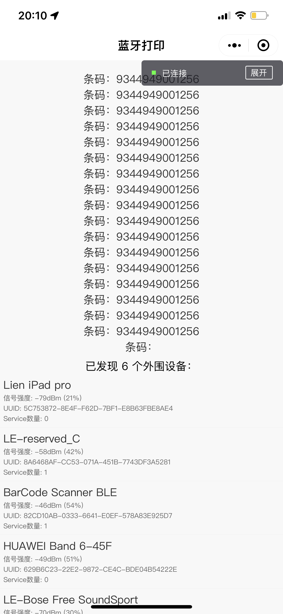
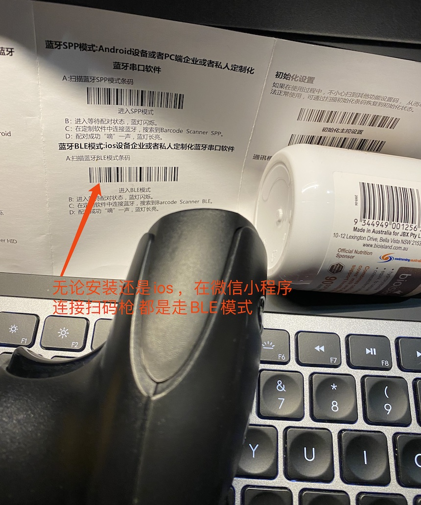

## 小程序蓝牙扫码枪实例
微信小程序蓝牙打印示例，代码参考[微信小程序示例](https://github.com/benioZhang/miniprogram-bluetoothprinter/)。官方Demo总比网上随便找的强吧。

* 测试扫码枪：[维融（weirong）LP1无线红光蓝牙扫描器 一维 蓝牙 1100mAh](https://u.jd.com/ZtHT8dm)
* 测试设备：iPhone 11 Pro Max

### 效果图
<div>
    
</div>

### 流程
* 初始化蓝牙模块 `wx.openBluetoothAdapter()`
* 搜寻附近的蓝牙外围设备 `wx.startBluetoothDevicesDiscovery()`
* 监听寻找到新设备的事件 `wx.onBluetoothDeviceFound()`
* 连接低功耗蓝牙设备 `wx.createBLEConnection()`
* 获取蓝牙设备服务 `wx.getBLEDeviceServices()`
* 获取蓝牙设备服务的特征值 `wx.getBLEDeviceCharacteristics()`
* 对支持notify 和 indicate的特征执行 `wx.notifyBLECharacteristicValueChange()` 和 `wx.onBLECharacteristicValueChange()`
* 关闭蓝牙模块 `wx.closeBluetoothAdapter()`

### 注意点
**1.与蓝牙设备通信很重要的就是找到对应的Characteristic。如何找到这个Characteristic？**  
目前只能一个个去试！！！如果有更好的做法请告诉我。


连接成功之后，在程序的任何地方,做如下监听，都可以实现读取条码
```
function ab2str(buf) {
  return String.fromCharCode.apply(null, new Uint8Array(buf));
}


wx.onBLECharacteristicValueChange((result) => { 
    console.log('监听特征值变化',result); 
    const barcode = ab2str(result.value);
    that.setData({barcode}) 
})
```

### 参考
* [微信小程序API](https://developers.weixin.qq.com/miniprogram/dev/api/)
* [微信小程序示例](https://github.com/wechat-miniprogram/miniprogram-demo)
* [低功耗蓝牙能力](https://developers.weixin.qq.com/community/develop/doc/0008acd004ccd86b37d649ee55b009?highLine=%25E8%2593%259D%25E7%2589%2599)
* [微信小程序 - 蓝牙接口](https://www.jianshu.com/p/d01dbca67461)
* [ESC(POS)打印控制命令](http://www.xmjjdz.com/downloads/manual/cn/ESC(POS)%E6%89%93%E5%8D%B0%E6%8E%A7%E5%88%B6%E5%91%BD%E4%BB%A4.pdf)
* [ESCPOS](https://github.com/song940/node-escpos)
